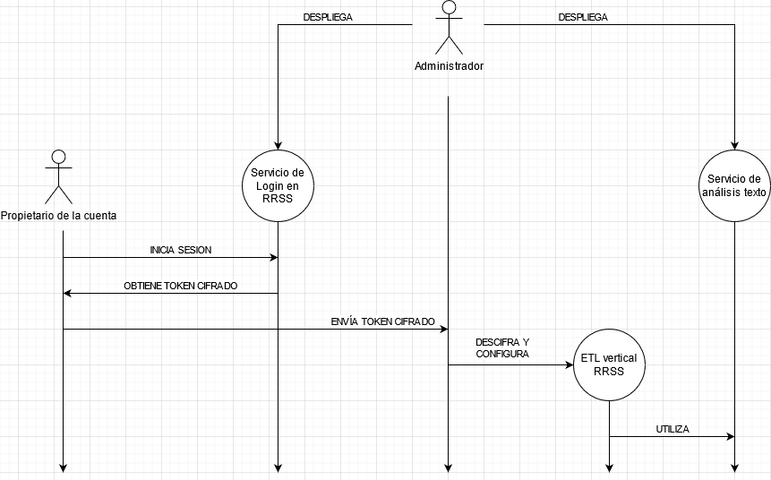

# Customer experience vertical

Este repositorio contiene varias construcciones para realizar analítica de redes sociales. Consiste en los siguientes componentes:

- El directorio [docker](docker) contiene el código de las distintas imágenes que se utilizan para realizar diferentes labores que requiere esta vertical (análisis de sentimiento, inicio de sesión en redes sociales...).

- El directorio [helm](helm) contiene las tablas Helm necesarias para desplegar las aplicaciones anteriores en un cluster de Kubernetes.

- El directorio [etls](etls) (obsoleto) contiene las versiones iniciales de los scripts de **extracción de datos de redes sociales**. Estos scripts han sido movidos a la [vertical de Social Networks de urbo](https://github.com/telefonicasc/socialnetworks-vertical).

## Arquitectura

La arquitectura de la vertical de Redes Sociales es la siguiente:

- El administrador de las ETLs despliega **dos servicios**:
    - Un servicio de [análisis de texto](helm/sentiment/README.md)
    - Un servicio de [inicio de sesión en redes sociales](helm/login/README.md)

- El propietario de la cuenta a analizar inicia sesión en una de las páginas de login, dependiendo de la red social a analizar
- La página de login genera un fichero de credenciales cifrado.
- El administrador de las ETLs **descifra el fichero** y lo usa para configurar las ETLs de la vertical.
- Ocasionalmente, las ETLs conectan tanto a la red social en cuestión, como al servicio de análisis de texto, para obtener los datos.
