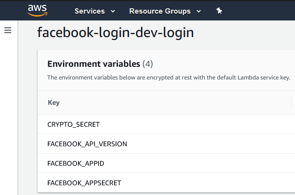
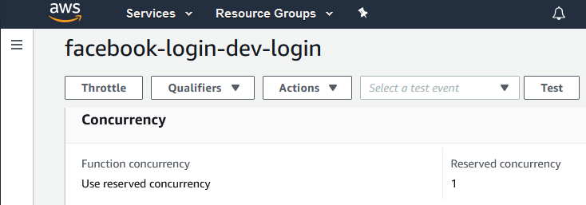

# Login facebook

Esta mini-aplicación solicita al usuario realizar un login en facebook, y a continuación obtiene un token de larga duración para consultar las estadísticas de las páginas de facebook del usuario logado.

## Despliegue

La aplicación está preparada para desplegarse en [Amazon Lambda](https://aws.amazon.com/es/lambda/). Para poder desplegarla, es necesario:

- Instalar [serverless](https://www.serverless.com/), para gestionar la creación del bundle.

```bash
npm install
```

- Crear un perfil de AWS con [credenciales autorizadas para subir funciones](https://www.serverless.com/framework/docs/providers/aws/guide/credentials/).

```bash
serverless config credentials --provider aws --key EXAMPLE_AWS_KEY_ID --secret EXAMPLE_AWS_KEY_SECRET
```

- Realizar el despliegue de la función con `sls deploy`:

```bash
sls deploy

Serverless: Using Python specified in "runtime": python3.8
Serverless: Packaging Python WSGI handler...
Serverless: Packaging required Python packages...
Serverless: Linking required Python packages...
Serverless: Packaging service...
Serverless: Excluding development dependencies...
Serverless: Unlinking required Python packages...
Serverless: Uploading CloudFormation file to S3...
Serverless: Uploading artifacts...
Serverless: Uploading service facebook-login.zip file to S3 (18.87 MB)...
Serverless: Validating template...
Serverless: Updating Stack...
Serverless: Checking Stack update progress...
..............
Serverless: Stack update finished...
Service Information
service: facebook-login
stage: dev
region: eu-west-3
stack: facebook-login-dev
resources: 12
api keys:
  None
endpoints:
  ANY - https://xxxxxx.execute-api.eu-west-3.amazonaws.com/dev
  ANY - https://xxxxxx.execute-api.eu-west-3.amazonaws.com/dev/{proxy+}
functions:
  login: facebook-login-dev-login
layers:
  None
```

## Configuración

Una vez desplegada la función, es necesario proporcionarle algunas variables de entorno desde la consola de gestión de AWS lambda:



- CRYPTO_SECRET: Una cadena aleatoria que se utiliza para cifrar el token que se le muestra al usuario por pantalla, una vez que inicia sesión en Facebook.
- FACEBOOK_API_VERSION: Versión de la Graph API de Facebook a utilizar. Esta aplicación se ha probado con la API `v8.0`.
- FACEBOOK_APPID: ID de aplicación de Facebook.
- FACEBOOK_APPSECRET: Clave de aplicación.

## Coste

Para limitar el uso de las funciones y evitar que un posible DoS acabe costando un dineral, es posible limitar la concurrencia de la función. Por ejemplo, limitando el número de instancias disponibles a "1", evitamos que se dispare el número de máquinas virtuales provisionadas:



Obviamente una instancia es escasa para servir a múltiples usuarios, pero para esta aplicación a la que sólo esperamos que se conecte un administrador muy ocasionalmente, es suficiente.
 
## Descifrado

Una vez el cliente inicia sesión en la página, obtiene un secreto parecido al siguiente:

```json
{
  "iv": "ph2Q0pG0D8OaIEMwOda1Aw==",
  "message": [
    "w6vfryOvBp++hX4bnlCkLQnuvvOwfwoiCM7o7TIa",
    "4L+/jZ+CgBKc5l3475456MsaDVkKsc273Z+gkSeI",
    "30/VWT4ygjhtjuq2wDliNDWfv6pLopltSey+WDKt",
    "7E4kIws+Y1p1s3iCULreuJu8iXymS3jEOzaxTYqA",
    "hpOzzquVEvG05PUifx0RfRrxfQgTa15kh6mfM3h1",
    "ke45ffg9UIRYUNduYAT8Atyutuvh5467lHmABww1",
    "K3tkl1NEX3wp0+XEwysLn//tfI5vr88aZ++Ns35T",
    "dCmrNWO4/////////////hNZ1N34un2nKD7QoRFM",
    "1rBS5sPRVbgaYt5XM1ISJA=="
  ]
}
```

Este código puede descifrarse ejecutando la aplicación, especificando como variable de entorno el mismo *CRYPTO_SECRET* que haya usado la web para la encriptación:

```bash
CRYPTO_SECRET=... python app.py '{ ... }'
```
