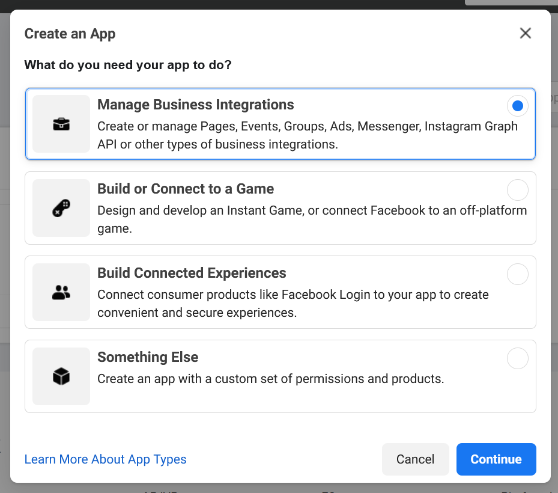
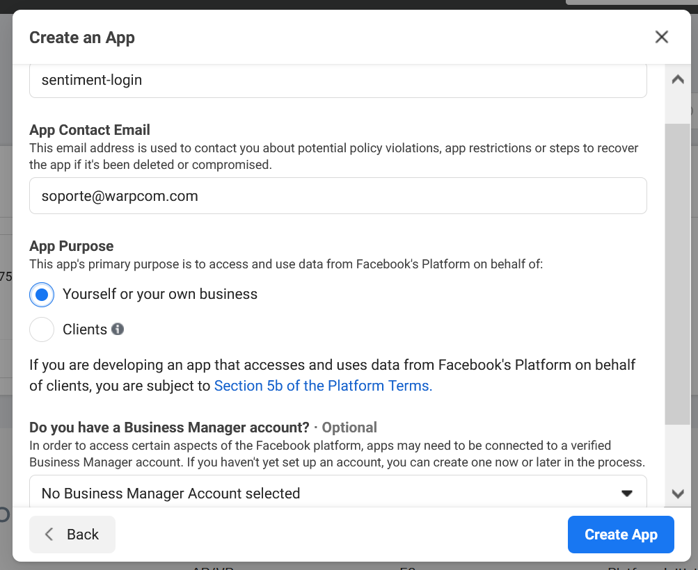

# Login facebook

Esta mini-aplicación solicita al usuario realizar un login en facebook, y a continuación obtiene un token de larga duración para consultar las estadísticas de las páginas de facebook o instagram del usuario logado.

El proceso para registrarse como desarrollador de Facebook y crear una app se resume en la URL https://developers.facebook.com/docs/development/, aunque a continuación se describen los pasos principales.

## Autorización

Para ejecutarse, la aplicación necesita un **ID y API Key de aplicación de facebook**, para acceder a la API.

### Creación de Facebook App

Desde la consola de desarrollador de Facebook (https://developers.facebook.com), se debe crear una nueva aplicación utilizando el botón *Create App*:


La aplicación deberá ser de tipo *Management App*:



Y las opciones iniciales de creación de la aplicación deben ser:

- Nombre de la aplicación: indiferente (en el ejemplo, *sentiment-login*).
- Email de contacto: Se publicará como email de contacto en la página de login del cliente.
- App Purpose: *Yourself or your own business*.
- Business Manager Account: no es necesario seleccionarla.



Una vez creada la aplicación, es necesario añadir el producto **Facebook Login**:


Al añadir el producto *Facebook Login*, el dashboard te ofrece un asistente de *quickstart*, pero no es necesario utilizarlo. Es suficiente con configurar los settings del producto de la siguiente forma:

- `Client oAuth Login`: Yes.
- `Web oAuth Login`: Yes.
- `Force Web oAuth Reauthentication`: No.
- `Use Strict Mode for Redirect URIs`: Yes.
- `Enforce HTTPS`: Yes.
- `Embedded Browser oAuth Login`: No.
- `Valid oAuth Redirect URLs`: Aquí deben enumerarse las URLs desde las que se acceda al portal de login, por ejemplo:

  - https://facebook.analytics.urbo2.es
  - https://localhost:8443


### Obtención de token

Una vez creada la aplicación, se puede obtener un token utilizando la herramienta **Access Token Tool** Disponible en https://developers.facebook.com/tools/accesstoken/:


El token a utilizar es el **App Token** obtenido por esa herramienta, que no caduca.

### Alta de usuarios

La aplicación puede utilizarse sin necesidad de pasar por el proceso de aprobación de Faceboo, siempre que los usuarios finales se den de alta como Beta Testers.

Para eso, las cuentas de usuario final deben cumplir estos requisitos:

•	Su cuenta de Instagram debe estar en modo Instagram Business Account o Instagram Creator Account
•	Sus cuentas de Facebook e Instagram deben estar conectadas (https://help.instagram.com/176235449218188).
•	La cuenta de Instagram debe estar enlazada con la página corporativa de Facebook de esa misma cuenta (https://help.instagram.com/399237934150902?fbclid=IwAR3e0oQtJUebuxVy94brOlLPJJjnTPYTC5-Plj-I9d10hFBlTqiJwCbniV8)

Si se cumplen esos requisitos, las cuentas de los usuarios pueden configurarse como testers de la aplicación, en la página de *Roles > testers > Add testers*:


### App Review

NOTA: Este paso **sólo es necesario** Si se quiere publicar la aplicación para que se puedan logar usuarios sin darles de alta como desarrolladores o testers.

En este caso, se debe enviar la aplicación para su revisión, solicitando los siguientes permisos:

- `instagram_manage_comments`
- `instagram_manage_insights`
- `instagram_basic`
- `pages_read_engagement`
- `read_insights`

## Despliegue

### Docker

La aplicación puede desplegarse como un contenedor docker, usando la imagen publicada en https://hub.docker.com/repository/docker/warpcomdev/facebook-login. Esta imagen acepta las siguientes **variables de entorno**:

- SECRET_KEY: Una cadena aleatoria que se utiliza para cifrar el token que se le muestra al usuario por pantalla, una vez que inicia sesión en Facebook.
- FACEBOOK_API_VERSION: Versión de la Graph API de Facebook a utilizar. Esta aplicación se ha probado con la API `v8.0`.
- FACEBOOK_APPID: ID de aplicación de Facebook.
- FACEBOOK_APPSECRET: Token de aplicación obtenido tal como se describe en el apartado anterior.

Por ejemplo, para ejecutar el servicio en el puerto 8443, se utilizaría el comando:

```bash
$ docker run --rm -it -p 8443:8443 -e SECRET_KEY=xxxxx -e FACEBOOK_API_VERSION=v8.0 -e FACEBOOK_APPID=xxxxxx -e FACEBOOK_APPSECRET=xxxxxx warpcomdev/facebook-login:latest flask run -h 0.0.0.0 -p 8443 --cert adhoc
```

De esta forma, se haría disponible el servicio en el puerto **8443**.

### Amazon Lambda

La aplicación está preparada para desplegarse en [Amazon Lambda](https://aws.amazon.com/es/lambda/). Para poder desplegarla, es necesario:

- Instalar [serverless](https://www.serverless.com/), para gestionar la creación del bundle.

```bash
npm install
```

- Crear un perfil de AWS con [credenciales autorizadas para subir funciones](https://www.serverless.com/framework/docs/providers/aws/guide/credentials/).

```bash
serverless config credentials --provider aws --key EXAMPLE_AWS_KEY_ID --secret EXAMPLE_AWS_KEY_SECRET
```

- Realizar el despliegue de la función con `sls deploy`:

```bash
sls deploy

Serverless: Using Python specified in "runtime": python3.8
Serverless: Packaging Python WSGI handler...
Serverless: Packaging required Python packages...
Serverless: Linking required Python packages...
Serverless: Packaging service...
Serverless: Excluding development dependencies...
Serverless: Unlinking required Python packages...
Serverless: Uploading CloudFormation file to S3...
Serverless: Uploading artifacts...
Serverless: Uploading service facebook-login.zip file to S3 (18.87 MB)...
Serverless: Validating template...
Serverless: Updating Stack...
Serverless: Checking Stack update progress...
..............
Serverless: Stack update finished...
Service Information
service: facebook-login
stage: dev
region: eu-west-3
stack: facebook-login-dev
resources: 12
api keys:
  None
endpoints:
  ANY - https://xxxxxx.execute-api.eu-west-3.amazonaws.com/dev
  ANY - https://xxxxxx.execute-api.eu-west-3.amazonaws.com/dev/{proxy+}
functions:
  login: facebook-login-dev-login
layers:
  None
```

Una vez desplegada la función, es necesario proporcionarle algunas variables de entorno desde la consola de gestión de AWS lambda:


- SECRET_KEY: Una cadena aleatoria que se utiliza para cifrar el token que se le muestra al usuario por pantalla, una vez que inicia sesión en Facebook.
- FACEBOOK_API_VERSION: Versión de la Graph API de Facebook a utilizar. Esta aplicación se ha probado con la API `v9.0`.
- FACEBOOK_APPID: ID de aplicación de Facebook.
- FACEBOOK_APPSECRET: Clave de aplicación.

### Coste

Para limitar el uso de las funciones y evitar que un posible DoS acabe costando un dineral, es posible limitar la concurrencia de la función. Por ejemplo, limitando el número de instancias disponibles a "1", evitamos que se dispare el número de máquinas virtuales provisionadas:


Obviamente una instancia es escasa para servir a múltiples usuarios, pero para esta aplicación a la que sólo esperamos que se conecte un administrador muy ocasionalmente, es suficiente.
 
## Descifrado

Una vez el cliente inicia sesión en la página, obtiene un secreto parecido al siguiente:

```json
{
  "iv": "ph2Q0pG0D8OaIEMwOda1Aw==",
  "message": [
    "w6vfryOvBp++hX4bnlCkLQnuvvOwfwoiCM7o7TIa",
    "4L+/jZ+CgBKc5l3475456MsaDVkKsc273Z+gkSeI",
    "30/VWT4ygjhtjuq2wDliNDWfv6pLopltSey+WDKt",
    "7E4kIws+Y1p1s3iCULreuJu8iXymS3jEOzaxTYqA",
    "hpOzzquVEvG05PUifx0RfRrxfQgTa15kh6mfM3h1",
    "ke45ffg9UIRYUNduYAT8Atyutuvh5467lHmABww1",
    "K3tkl1NEX3wp0+XEwysLn//tfI5vr88aZ++Ns35T",
    "dCmrNWO4/////////////hNZ1N34un2nKD7QoRFM",
    "1rBS5sPRVbgaYt5XM1ISJA=="
  ]
}
```

Este código puede descifrarse ejecutando la aplicación, especificando como variable de entorno el mismo *SECRET_KEY* que haya usado la web para la encriptación:

```bash
SECRET_KEY=... python app.py '{ ... }'
```
