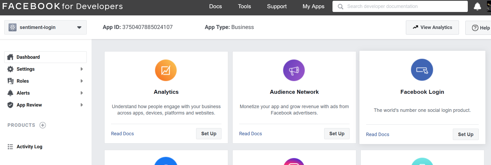
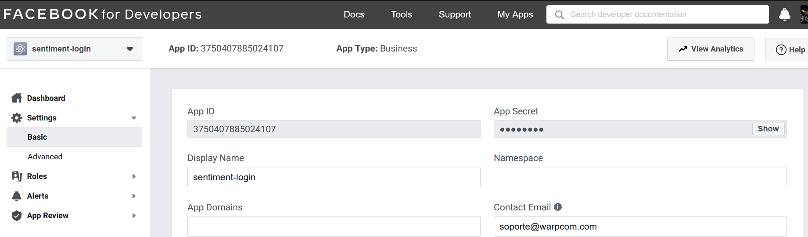

# Login facebook

## Autorización

Para obtener la información de la cuenta, la vertical necesita un token de página de larga duración ([long-lived page token](https://developers.facebook.com/docs/facebook-login/access-tokens/refreshing/)). Este token es el que permitirá recopilar la información estadística de las páginas de facebook autorizadas.

Los tokens de acceso se asocian a una **aplicación de facebook**, identificada por los valores de **ID y API Key** de aplicación de facebook, para acceder a la API. El proceso para registrarse como desarrollador de Facebook y crear una app se resume en la URL https://developers.facebook.com/docs/development/, aunque a continuación se describen los pasos principales.

### Creación de Facebook App

Desde la consola de desarrollador de Facebook (https://developers.facebook.com), se debe crear una nueva aplicación utilizando el botón *Create App*:


La aplicación deberá ser de tipo *Manage Business Integrations*:


Y las opciones iniciales de creación de la aplicación deben ser:

- Nombre de la aplicación: indiferente (en el ejemplo, *sentiment-login*).
- Email de contacto: Se publicará como email de contacto en la página de login del cliente.
- App Purpose: *Yourself or your own business*.
- Business Manager Account: no es necesario seleccionarla.


Una vez creada la aplicación, es necesario añadir el producto **Facebook Login**:



Al añadir el producto *Facebook Login*, el dashboard te ofrece un asistente de *quickstart*, pero no es necesario utilizarlo. Es suficiente con configurar los settings del producto de la siguiente forma:

- `Client oAuth Login`: Yes.
- `Web oAuth Login`: Yes.
- `Force Web oAuth Reauthentication`: No.
- `Use Strict Mode for Redirect URIs`: Yes.
- `Enforce HTTPS`: Yes.
- `Embedded Browser oAuth Login`: No.
- `Valid oAuth Redirect URLs`: Aquí deben enumerarse las URLs desde las que se acceda al portal de login, por ejemplo:

  - https://f.analytics.urbo2.es
  - https://localhost:8443


### Obtención de secreto de aplicación

Una vez creada la aplicación, se puede obtener el secreto de la aplicacion en la opción *Settings > Basic > App Secret*::



El secreto de aplicación a utilizar es el **App Secret** obtenido al pulsar sobre el botón *Show*.

### Alta de usuarios

La aplicación puede utilizarse sin necesidad de pasar por el proceso de aprobación de Facebook, siempre que los usuarios finales se den de alta como Beta Testers.

Para eso, las cuentas de usuario final deben cumplir estos requisitos:

- Su cuenta de Instagram debe estar en modo Instagram Business Account o Instagram Creator Account
- Sus cuentas de Facebook e Instagram deben estar conectadas (https://help.instagram.com/176235449218188).
- La cuenta de Instagram debe estar enlazada con la página corporativa de Facebook de esa misma cuenta (https://help.instagram.com/399237934150902?fbclid=IwAR3e0oQtJUebuxVy94brOlLPJJjnTPYTC5-Plj-I9d10hFBlTqiJwCbniV8)

Si se cumplen esos requisitos, las cuentas de los usuarios pueden configurarse como testers de la aplicación, en la página de *Roles > testers > Add testers*:


### App Review

NOTA: Este paso **sólo es necesario** Si se quiere publicar la aplicación para que se puedan logar usuarios sin darles de alta como desarrolladores o testers.

En este caso, se debe enviar la aplicación para su revisión, solicitando los siguientes permisos:

- `instagram_manage_comments`
- `instagram_manage_insights`
- `instagram_basic`
- `pages_read_engagement`
- `read_insights`
- `business_management`

### Generación de token de usuario

Una vez dada de alta la aplicación, y añadidos como BetaTesters los usuarios de Facebook cuyas estadísticas se quieran recopilar, se debe obtener un token de página de larga duración. El primer paso para ello es obtener el token de usuario desde la consola de desarrollador de Facebook:

https://developers.facebook.com/apps/?show_reminder=true

- Seleccionar la aplicación creada

- Ir al menú "Tools > Graph API Explorer"


- En el menú lateral, seleccionar los permisos mostrados en la imagen, y pulsar en "Generate Access Token"


El proceso de login debe completarse **con la cuenta de usuario del propietario de las páginas a analizar**. Durante el login, Facebook pedirá confirmación de varias cosas:

- La cuenta de instagram con la que está enlazada la cuenta de Facebook. Es necesario dar permiso sobre la cuenta que se quiera analizar.


- Las páginas web de Facebook para las que podrá recopilarse información. Es necesario dar permisos sobre todas las páginas.


- Por último, es necesario dar a la aplicación permisos de análisis de datos sobre esas páginas. Los permisos para leer y enviar posts y comentarios se pueden deshabilitar:


Una vez completado el proceso de login, se puede copiar el token generado por Facebook y utilizarlo para obtener un [long-lived page token]() como se describe en el siguiente paso.

### Token de larga duración

El token obtenido en la consola de desarrollo tiene un tiempo de vida corto. La ETL necesita un token con tiempo de vida más largo, que puede obtenerse siguiendo las instrucciones de esta URL:

https://developers.facebook.com/docs/facebook-login/access-tokens/refreshing/

- Utilizando la herramienta "Access-token debugger" de la web de desarrolladores de Facebook, obtener el client-ID del token de usuario


- Solicitar un token de usuario de larga duración, usando el token de acceso estándar que obtuvimos en el paso anterior:

```bash
$ export APP_ID="your facebook app id"
$ export APP_SECRET="your facebook app secret"
$ export APP_TOKEN="regular user token"
$ curl -i -X GET "https://graph.facebook.com/v10.0/oauth/access_token?grant_type=fb_exchange_token&client_id=$APP_ID&client_secret=$APP_SECRET&fb_exchange_token=$APP_TOKEN" 


HTTP/2 200 
access-control-allow-origin: *
pragma: no-cache
cache-control: private, no-cache, no-store, must-revalidate
x-fb-rev: 1003651901
content-type: application/json; charset=UTF-8
x-fb-trace-id: DrSLsL83a9m
strict-transport-security: max-age=15552000; preload
x-fb-request-id: ARyq7ATALHyXVbx3sJwCXUI
facebook-api-version: v10.0
expires: Sat, 01 Jan 2000 00:00:00 GMT
x-fb-debug: ...
content-length: 223
date: Tue, 20 Apr 2021 14:17:32 GMT
priority: u=3,i
alt-svc: h3-29=":443"; ma=3600,h3-27=":443"; ma=3600

{"access_token":"  ... your long lived token is here ...","token_type":"bearer"}
```

- Con el token de usuario de larga duración, obtener un token de página de larga duración:

```bash
$ export FB_USER_ID="Facebook user ID"
$ export FB_LONG_LIVED_TOKEN="your user long lived token here"
$ curl -i -X GET "https://graph.facebook.com/v10.0/$FB_USER_ID/accounts?access_token=$FB_LONG_LIVED_TOKEN"

HTTP/1.1 200 Connection established

HTTP/2 200 
etag: "abc931c9dc50b044a3bc44db6b13806c8668dd60"
expires: Sat, 01 Jan 2000 00:00:00 GMT
content-type: application/json; charset=UTF-8
facebook-api-version: v10.0
x-fb-request-id: AILyE6CV-ROP8bzVcSjecpU
strict-transport-security: max-age=15552000; preload
x-fb-trace-id: Af3i7JrqKqt
x-fb-rev: 1003652187
cache-control: private, no-cache, no-store, must-revalidate
vary: Accept-Encoding
pragma: no-cache
x-app-usage: {"call_count":3,"total_cputime":0,"total_time":1}
x-fb-rlafr: 0
access-control-allow-origin: *
x-fb-debug: ...
date: Tue, 20 Apr 2021 14:23:42 GMT
priority: u=3,i
alt-svc: h3-29=":443"; ma=3600,h3-27=":443"; ma=3600

{"data":[{"access_token":"... your long lived page token here ...","category":"Test Preparation Center","category_list":[{"id":"191914921205687","name":"Test Preparation Center"}],"name":"Analytics Test","id":"104712934460896","tasks":["ANALYZE","ADVERTISE","MESSAGING","MODERATE","CREATE_CONTENT","MANAGE"]}],"paging":{"cursors":{"before":"MTA0NzEyOTM0NDYwODk2","after":"MTA0NzEyOTM0NDYwODk2"}}}
```
