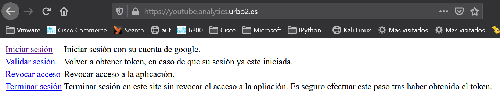
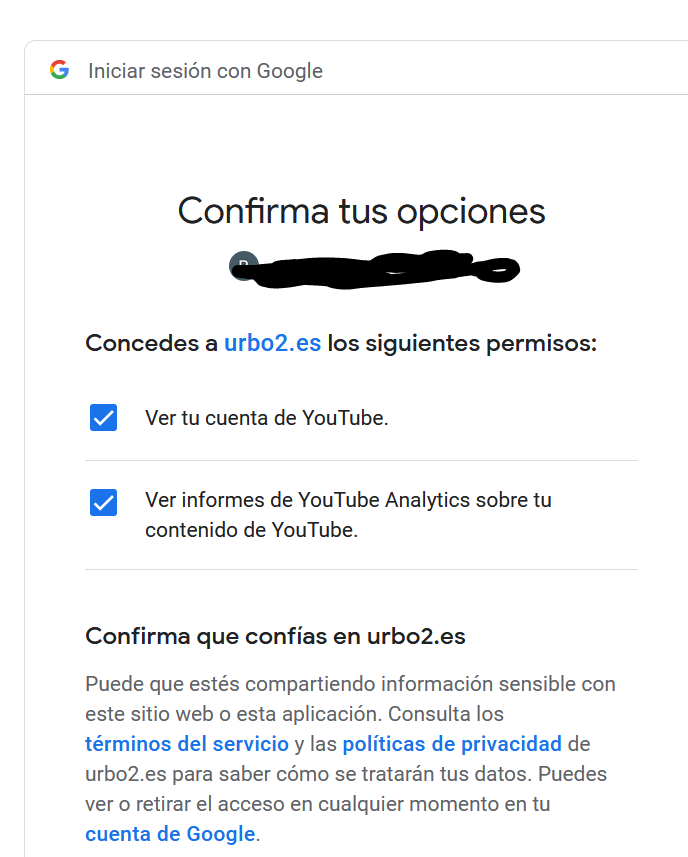
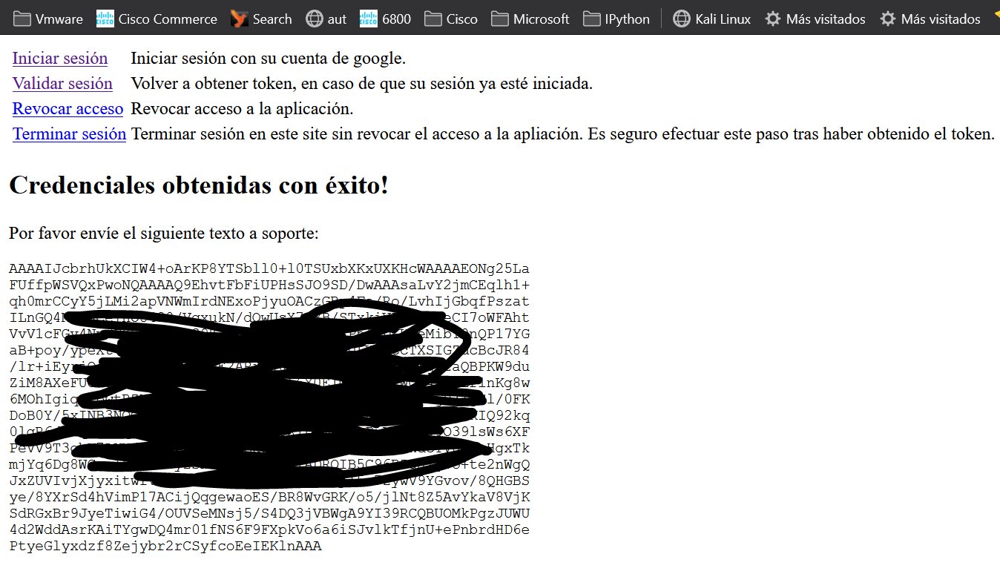

# Login youtube

Esta mini-aplicación solicita al usuario realizar un login en youtube, y a continuación obtiene un token para consultar las estadísticas de los vídeos de Youtube del usuario logado.

Las instrucciones para obtener una cuenta de desarrollador con la que utilizar esta aplicación están en el fichero [developer.md](developer.md).

**IMPORTANTE**: El fichero `client_secret.json` con las credenciales de la aplicación debe guardarse con el nombre `client_secret.json` en el directorio `secrets` (si se va a desplegar en AWS lambda).

## Despliegue

### Docker

La aplicación puede desplegarse como un contenedor docker, usando la imagen publicada en https://hub.docker.com/repository/docker/warpcomdev/youtube-login. Esta imagen acepta las siguientes **variables de entorno**:

- `SERVICE_NAME`: Nombre del servicio / API de google que se va a consultar. Por defecto, **youtubereporting**.
- `SECRET_KEY`: Secreto con el que se cifran y descifran las credenciales del usuario.
- `API_VERSION`: Versión de la API de Google Discovery (por defecto, **v1**).
- `SECRET_PATH`: Ruta al directorio donde está el fichero de credenciales `client_secret.json` (por defecto, **secrets**).
- `DEBUG`: "1" para activar el log de debug, "0" en otro caso.


Por ejemplo, para ejecutar el servicio en el puerto 8443, teniendo el fichero `client_secret.json` guardado en la ruta `secrets`, se utilizaría el comando:

```bash
$ docker run --rm -it -v ${PWD}/secrets:/app/secrets -p 8443:8443 -e SECRET_KEY=xxxxx warpcomdev/youtube-login:latest flask run -h 0.0.0.0 -p 8443 --cert adhoc
```

De esta forma, se haría disponible el servicio en el puerto **8443**.

### Amazon Lambda

La aplicación está preparada para desplegarse en [Amazon Lambda](https://aws.amazon.com/es/lambda/). Para poder desplegarla, es necesario:

- Instalar [serverless](https://www.serverless.com/), para gestionar la creación del bundle.

```bash
npm install
```

- Crear un perfil de AWS con [credenciales autorizadas para subir funciones](https://www.serverless.com/framework/docs/providers/aws/guide/credentials/).

```bash
serverless config credentials --provider aws --key EXAMPLE_AWS_KEY_ID --secret EXAMPLE_AWS_KEY_SECRET
```

- Realizar el despliegue de la función con `sls deploy`:

```bash
sls deploy

Serverless: Using Python specified in "runtime": python3.8
Serverless: Packaging Python WSGI handler...
Serverless: Packaging required Python packages...
Serverless: Linking required Python packages...
Serverless: Packaging service...
Serverless: Excluding development dependencies...
Serverless: Unlinking required Python packages...
Serverless: Uploading CloudFormation file to S3...
Serverless: Uploading artifacts...
Serverless: Uploading service youtube-login.zip file to S3 (18.87 MB)...
Serverless: Validating template...
Serverless: Updating Stack...
Serverless: Checking Stack update progress...
..............
Serverless: Stack update finished...
Service Information
service: youtube-login
stage: dev
region: eu-west-3
stack: youtube-login-dev
resources: 12
api keys:
  None
endpoints:
  ANY - https://xxxxxx.execute-api.eu-west-3.amazonaws.com/dev
  ANY - https://xxxxxx.execute-api.eu-west-3.amazonaws.com/dev/{proxy+}
functions:
  login: youtube-login-dev-login
layers:
  None
```

Una vez desplegado, se deben configurar las siguientes variables en el entorno de Amazon Lambda:

- `SERVICE_NAME`: **youtubereporting**.
- `SECRET_KEY`: Secreto con el que se cifran y descifran las credenciales del usuario.
- `API_VERSION`: **v1**.
- `SECRET_PATH`: **secrets**.

!(youtube secret key)[static/img/youtube_secret_key.png]

### Coste

Para limitar el uso de las funciones y evitar que un posible DoS acabe costando un dineral, es posible limitar la concurrencia de la función. Por ejemplo, limitando el número de instancias disponibles a "1", evitamos que se dispare el número de máquinas virtuales provisionadas:


Obviamente una instancia es escasa para servir a múltiples usuarios, pero para esta aplicación a la que sólo esperamos que se conecte un administrador muy ocasionalmente, es suficiente.

## Uso de la aplicación

### Inicio de sesión

El objetivo de esta aplicación es obtener un token que pueda ser utilizado para consultar la API de google en representación de nuestro cliente final.

Para eso, el cliente **debe iniciar sesión** en la URL en la que se haya publicado esta aplicación, por ejemplo:



Una vez iniciada sesión en esta página, se deberá autorizar el acceso a las APIs de Youtube y Youtube Reporting:



La confirmación del acceso genera un **token**, que la aplicación cifra con la clave especificada en la variables de entorno `SECRET_KEY`. El texto cifrado se le muestra al cliente por pantalla:



El texto cifrado puede descifrarse utilizando esta misma aplicación, y la clave secreta.

### Descifrado de credenciales

Las credenciales obtenidas por el cliente pueden descifrarse ejecutando la aplicación `app.py` desde la línea de comandos, indicando el mismo valor de `SECRET_KEY` que se haya utilizado para cifrar el texto:

```bash
$ docker run --rm -it -e SECRET_KEY=xxx...xxx warpcomdev/youtube-login:latest python app.py 'AAAAIJcbrhUkXCIW4+oArKP8YTSbll0+l0TSUxbXKxUXKHcWAAAAEONg25La
> FUffpWSVQxPwoNQAAAAQ9EhvtFbFiUPHsSJO9SD/DwAAAsaLvY2jmCEqlh1+
> qh0mrCCyY5jLMi2apVNWmIrdNExoPjyuOACzGBy4Fe/Ro/LvhIjGbqfPszat
> ...
> 4d2WddAsrKAiTYgwDQ4mr01fNS6F9FXpkVo6a6iSJvlkTfjnU+ePnbrdHD6e
> PtyeGlyxdzf8Zejybr2rCSyfcoEeIEKlnAAA'
```

Esto generará un resultado como el siguiente:

```json
{
  "credentials": {
    "client_id": "xxx...xxx",
    "client_secret": "xxx...xxx",
    "refresh_token": "xxx...xxx",
    "scopes": [
      "https://www.googleapis.com/auth/youtube.readonly",
      "https://www.googleapis.com/auth/yt-analytics.readonly"
    ],
    "token": "xxx...xxx",
    "token_uri": "https://oauth2.googleapis.com/token"
  },
  "methods": [
    "jobs",
    "media",
    "new_batch_http_request",
    "reportTypes"
  ]
}
```

Este fichero es el que podrá usarse para ejecutar las ETLs de carga de datos de Youtube.
