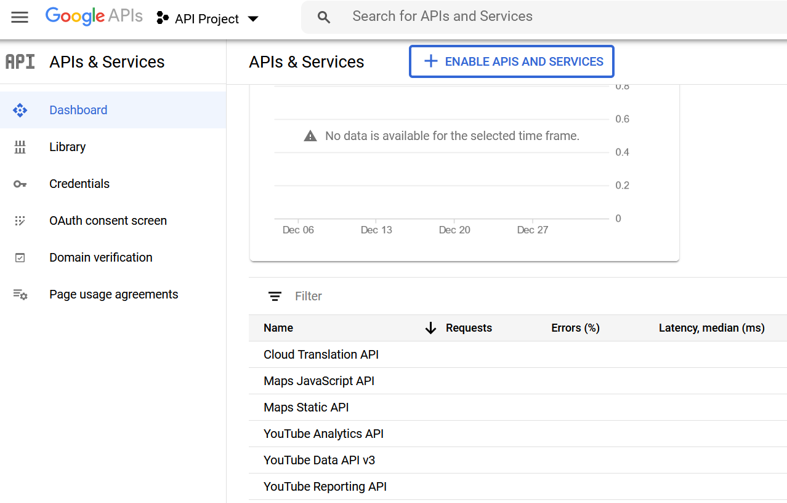
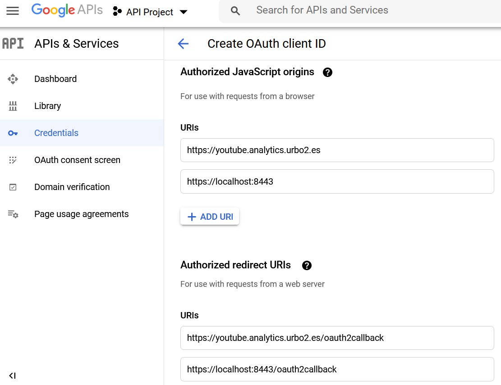
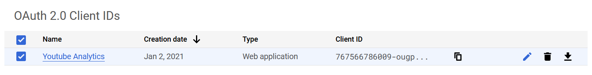

# Login youtube

Esta mini-aplicación solicita al usuario realizar un login en youtube, y a continuación obtiene un token para consultar las estadísticas de los vídeos de Youtube del usuario logado.

## Autorización

Para ejecutarse, la aplicación necesita un **proyecto de google APIs** para acceder a la API de Youtube, y un **ID de cliente oAuth 2.0** de la API de Youtube Analytics.

El proceso se resume en la URL https://developers.google.com/youtube/v3/getting-started, aunque a continuación se describen los pasos principales.

### Creación de proyecto en Google API console

Es necesario crear un proyecto en la consola de Google API (https://console.developers.google.com/) utilizando una cuenta de usuario de google.

- Las instrucciones para crear un proyecto se pueden consultar en: https://support.google.com/googleapi/answer/6251787?hl=en
- El nombre del proyecto es irrelevante para esta aplicación, puede elegirse cualquiera.

Es también imprescindible que se habilite el acceso a las siguientes APIs en el proyecto:

- Youtube Data API v3
- Youtube Reporting API
- Youtube Analytics API



### Obtención de credenciales oAuth

Una vez creado un proyecto en el dashboard de Google API, y activadas las APIs de Youtube, es necesario obtener un fichero de credenciales para autenticación oAuth2.

El flujo de autorización oAuth2 que debe seleccionarse es **web server app**. La documentación relativa a este flujo de autorización se encuentra aquí: https://developers.google.com/youtube/v3/guides/auth/server-side-web-apps.

De manera resumida, los pasos a seguir para obtener las credenciales oAuth son:

- Acceder a la página de credenciales del proyecto, y seleccionar *create credentials* > **OAuth Client ID**.


- Indicar el tipo de aplicación **Web application**, y seleccionar un nombre descriptivo para la aplicación (el nombre elegido es indiferente).


- Añadir las URLs públicas de la aplicación en los apartados **Authorized JavaScript Origins** y **Authorized Redirect URIs**.

Es importante **usar la URL pública con la que se vaya a acceder a la página de login**. Si no se configuran correctamente estas URLs en la cuenta de google, la autenticación fallará.

Por ejemplo, si el dominio en que se publica el portal es *youtube.analytics.urbo2.es*, las URLs a configurar son:

- *Authorized Javascript Origins*:
  - https://youtube.analytics.urbo2.es
  - https://localhost:8443

- *Authorized Redirect URIs*:
  - https://youtube.analytics.urbo2.es/oauth2callback
  - https://localhost:8443/oauth2callback



- Tras aceptar y crear las credenciales, se debe utilizar el botón de descarga en el dashboard para poder descargar estas credenciales en formato json:



El resultado de este proceso es un fichero json con el siguiente aspecto:

```json
{
    "web": {
        "client_id": "xxx...xxx",
        "project_id": "xxx...xxx",
        "auth_uri": "https://accounts.google.com/o/oauth2/auth",
        "token_uri": "https://oauth2.googleapis.com/token",
        "auth_provider_x509_cert_url": "https://www.googleapis.com/oauth2/v1/certs",
        "client_secret": "xxx.xxx",
        "redirect_uris": [
            "https://youtube.analytics.urbo2.es/oauth2callback",
            "https://localhost:8443/oauth2callback"
        ],
        "javascript_origins": [
            "https://youtube.analytics.urbo2.es",
            "https://localhost:8443"
        ]
    }
}
```

Este fichero debe guardarse con el nombre `secrets/client_secret.json`

## Despliegue

### Docker

La aplicación puede desplegarse como un contenedor docker. 
### Amazon Lambda

La aplicación está preparada para desplegarse en [Amazon Lambda](https://aws.amazon.com/es/lambda/). Para poder desplegarla, es necesario:

- Instalar [serverless](https://www.serverless.com/), para gestionar la creación del bundle.

```bash
npm install
```

- Crear un perfil de AWS con [credenciales autorizadas para subir funciones](https://www.serverless.com/framework/docs/providers/aws/guide/credentials/).

```bash
serverless config credentials --provider aws --key EXAMPLE_AWS_KEY_ID --secret EXAMPLE_AWS_KEY_SECRET
```

- Realizar el despliegue de la función con `sls deploy`:

```bash
sls deploy

Serverless: Using Python specified in "runtime": python3.8
Serverless: Packaging Python WSGI handler...
Serverless: Packaging required Python packages...
Serverless: Linking required Python packages...
Serverless: Packaging service...
Serverless: Excluding development dependencies...
Serverless: Unlinking required Python packages...
Serverless: Uploading CloudFormation file to S3...
Serverless: Uploading artifacts...
Serverless: Uploading service facebook-login.zip file to S3 (18.87 MB)...
Serverless: Validating template...
Serverless: Updating Stack...
Serverless: Checking Stack update progress...
..............
Serverless: Stack update finished...
Service Information
service: facebook-login
stage: dev
region: eu-west-3
stack: youtube-login-dev
resources: 12
api keys:
  None
endpoints:
  ANY - https://xxxxxx.execute-api.eu-west-3.amazonaws.com/dev
  ANY - https://xxxxxx.execute-api.eu-west-3.amazonaws.com/dev/{proxy+}
functions:
  login: youtube-login-dev-login
layers:
  None
```

### Coste

Para limitar el uso de las funciones y evitar que un posible DoS acabe costando un dineral, es posible limitar la concurrencia de la función. Por ejemplo, limitando el número de instancias disponibles a "1", evitamos que se dispare el número de máquinas virtuales provisionadas:


Obviamente una instancia es escasa para servir a múltiples usuarios, pero para esta aplicación a la que sólo esperamos que se conecte un administrador muy ocasionalmente, es suficiente.

