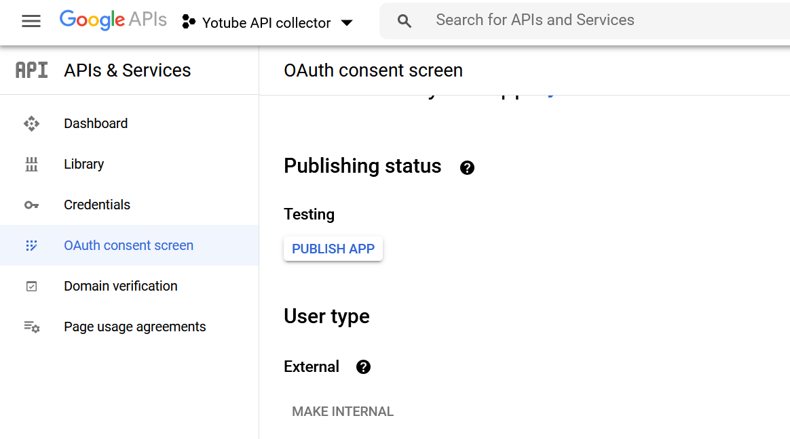

# Login youtube

## Autorización

Para ejecutarse, la vertical necesita un **proyecto de google APIs** para acceder a la API de Youtube, y un **ID de cliente oAuth 2.0** de la API de Youtube Analytics.

El proceso se resume en la URL https://developers.google.com/youtube/v3/getting-started, aunque a continuación se describen los pasos principales.

### Creación de proyecto en Google API console

Es necesario crear un proyecto en la consola de Google API (https://console.developers.google.com/) utilizando una cuenta de usuario de google.

- Las instrucciones para crear un proyecto se pueden consultar en: https://support.google.com/googleapi/answer/6251787?hl=en
- El nombre del proyecto es irrelevante para esta aplicación, puede elegirse cualquiera.

Es también imprescindible que se habilite el acceso a las siguientes APIs en el proyecto:

- Youtube Data API v3
- Youtube Reporting API
- Youtube Analytics API

Opcional:
- Google My Business API


### Obtención de credenciales oAuth

Una vez creado un proyecto en el dashboard de Google API, y activadas las APIs de Youtube y Google My Business, es necesario obtener un fichero de credenciales para autenticación oAuth2.

El flujo de autorización oAuth2 que debe seleccionarse es **web server app**. La documentación relativa a este flujo de autorización se encuentra aquí: https://developers.google.com/youtube/v3/guides/auth/server-side-web-apps.

De manera resumida, los pasos a seguir para obtener las credenciales oAuth son:

- Acceder a la página de credenciales del proyecto, y seleccionar *create credentials* > **OAuth Client ID**.


- Indicar el tipo de aplicación **Web application**, y seleccionar un nombre descriptivo para la aplicación (el nombre elegido es indiferente).


- Añadir las URLs públicas de la aplicación en los apartados **Authorized JavaScript Origins** y **Authorized Redirect URIs**.

Si se va a obtener el token manualmente usando las herramientas de desarrollo del API de google oauth, generalmente es suficiente especificar una URL local (como http://localhost:8080) como origen y dominio de callback. Si se va a subir una página de login a algún portal web, es importante usar también la URL pública con la que se vaya a acceder a dicho portal. 

Por ejemplo, estas URLS podrían usarse para permitir generar tokens tanto desde el PC local (para el desarrollador), como desde una web subida a https://youtube.analytics.urbo2.es:

- *Authorized Javascript Origins*:
  - https://youtube.analytics.urbo2.es
  - https://localhost:8443

- *Authorized Redirect URIs*:
  - https://youtube.analytics.urbo2.es/oauth2callback
  - https://localhost:8443/oauth2callback


Si simplemente se va a obtener un token manualmente siguiendo las instrucciones de este documento, las URLs que se configuren no son importantes.

- Tras aceptar y crear las credenciales, se debe utilizar el botón de descarga en el dashboard para poder descargar estas credenciales en formato json:


El resultado de este proceso es un fichero json con el siguiente aspecto:

```json
{
    "web": {
        "client_id": "xxx...xxx",
        "project_id": "xxx...xxx",
        "auth_uri": "https://accounts.google.com/o/oauth2/auth",
        "token_uri": "https://oauth2.googleapis.com/token",
        "auth_provider_x509_cert_url": "https://www.googleapis.com/oauth2/v1/certs",
        "client_secret": "xxx.xxx",
        "redirect_uris": [
            "https://youtube.analytics.urbo2.es/oauth2callback",
            "https://localhost:8443/oauth2callback"
        ],
        "javascript_origins": [
            "https://youtube.analytics.urbo2.es",
            "https://localhost:8443"
        ]
    }
}
```

### Consent screen

El siguiente paso es **publicar la aplicación en google**, para que los usuarios puedan utilizarla. En principio no es necesario verificar la aplicación, sólo publicarla en el menú **oAuth consent screen** del dashboard de Google API:



**NOTA**: Es imprescindible que la App se publique (el modo debe pasar de "Testing" a "production"), en caso contrario los tokens caducarán cada semana.

### Obtención de token

El último paso necesario es obtener un **refresh token** de la cuenta del usuario cuyas estadísticas se van a recopilar, configurado con **access_type=offline**. Marcar el token como acceso offline permite a la aplicación refrescarlo cuando sea conveniente sin que sea necesario que el usuario esté iniciando sesión en la aplicación cada cierto tiempo.

La obtención de un token de usuario está documentada en:

https://developers.google.com/identity/protocols/oauth2

Recomendamos seguir los ejemplos incluidos para [server-side apps](https://developers.google.com/identity/protocols/oauth2/web-server), en concreto los pasos:

- [Step 1: set authorization parameters](https://developers.google.com/identity/protocols/oauth2/web-server#creatingclient). En este paso es **muy importante** establecer el `scope` y `access_Type` correcto:

- **scopes**:

  - https://www.googleapis.com/auth/youtube.readonly
  - https://www.googleapis.com/auth/yt-analytics.readonly
  - https://www.googleapis.com/auth/business.manage

- **access_type**: offline

- [Step 2: Redirect to google oauth server](https://developers.google.com/identity/protocols/oauth2/web-server#redirecting)
- [Step 4: Handle the oAuth 2.0 server response](https://developers.google.com/identity/protocols/oauth2/web-server#handlingresponse)
- [Step 5: Exchange authorization code for refresh and access token](https://developers.google.com/identity/protocols/oauth2/web-server#exchange-authorization-code). Este último paso es el que nos permite obtener el **refresh token**.

El fichero de credenciales json descargado desde el portal de desarrollo, y el token de refresco obtenido de la API oAuth de google, son los dos elementos de configuración que requiere la vertical.
