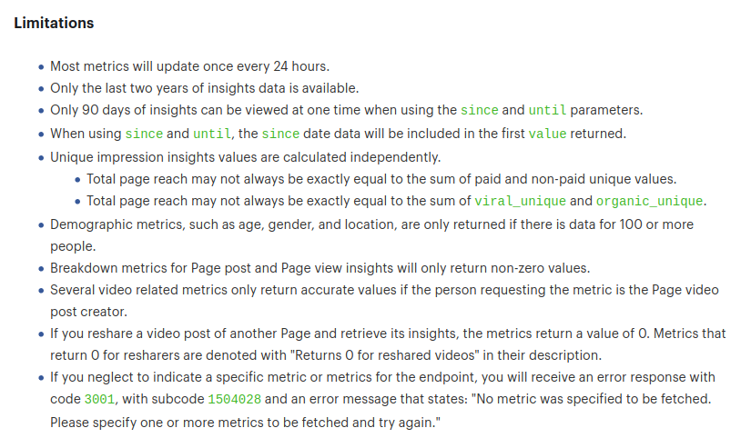
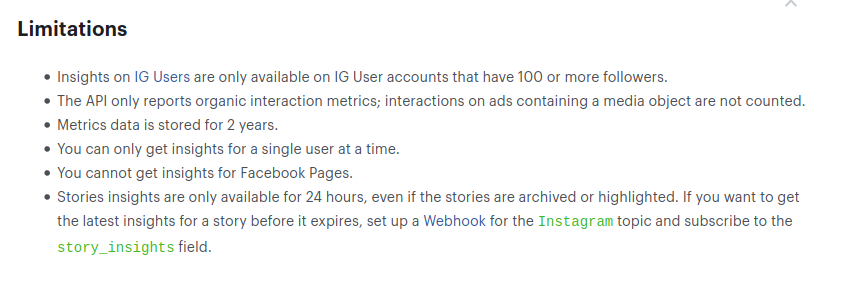

# Facebook

Esta carpeta contiene la ETL de análisis de datos de facebook.

## Métricas

La ETL recopila de las APIs de Facebook e Instagra una lista de métricas configurable. Por cada una de las métricas, la ETL genera una entidad de tipo `KeyPerformanceIndicator`, con su valor diario.

La lista de métricas que debe recopilar se enumera en los ficheros [facebook_metrics.csv`](facebook_metrics.csv) e [instagram_metrics.csv](instagram_metrics.csv), que contienen en cada fila:

- El nombre de la métrica (`Metric`).
- La descripción (`Description`).
- La granularidad de la métrica. La ETL sólo reconoce dos valores posibles:

  - `day`, para métricas que representan datos diarios.
  - `lifetime`, para métricas que representan datos acumulados.

Aunque la API soporta otras granularidades (`week`, `days_28`), la ETL no hace uso de ellas.

El contenido inicial de estos ficheros se ha creado con lalista completa de métricas disponibles en la versión 11.0 de la API de Facebook, que puede consultarse en estos enlaces:

- https://developers.facebook.com/docs/graph-api/reference/v11.0/insights
- https://developers.facebook.com/docs/instagram-api/reference/ig-user/insights

Si a futuro se añaden o eliminan métricas de la API de Facebook, mientras se mantenga el formato de la API GraphQL, será suficiente actualizar el listado de métricas para actualizar en consecuencia la lista de `KeyPerformanceIndicator`s importados.

**facebook_metrics.csv**

```csv
Metric,Description,Granularity
page_actions_post_reactions_anger_total,"Daily total post ""anger"" reactions of a page.",day
page_actions_post_reactions_haha_total,"Daily total post ""haha"" reactions of a page.",day
page_actions_post_reactions_like_total,"Daily total post ""like"" reactions of a page.",day
page_actions_post_reactions_love_total,"Daily total post ""love"" reactions of a page.",day
page_actions_post_reactions_sorry_total,"Daily total post ""sorry"" reactions of a page.",day
page_actions_post_reactions_total,Daily total post reactions of a page by type.,day
page_actions_post_reactions_wow_total,"Daily total post ""wow"" reactions of a page.",day
page_call_phone_clicks_by_age_gender_logged_in_unique,"Number of people who logged in to Facebook and clicked the Call Now button, broken down by age and gender group.",day
page_call_phone_clicks_by_site_logged_in_unique,"The number of people who clicked your Page's phone number or Call Now button while they were logged into Facebook, broken down by the type of device they used.",day
page_call_phone_clicks_logged_in_by_city_unique,"Number of people who logged in to Facebook and clicked the Call Now button, broken down by city.",day
page_call_phone_clicks_logged_in_by_country_unique,"Number of people who logged in to Facebook and clicked the Call Now button, broken down by countries.",day
page_call_phone_clicks_logged_in_unique,Number of people who logged in to Facebook and clicked the Call Now button.,day
page_consumptions,The number of times people clicked on any of your content.,day
page_consumptions_by_consumption_type,"The number of times people clicked on any of your content, by type.",day
page_consumptions_by_consumption_type_unique,"The number of people who clicked on any of your content, by type.",day
page_consumptions_unique,The number of people who clicked on any of your content.,day
page_content_activity,The number of stories created about your Page (Stories).,day
page_content_activity_by_action_type,"The number of stories about your Page's stories, by Page story type. (See possible types)",day
page_content_activity_by_action_type_unique,"The number of people talking about your Page's stories, by Page story type. (See possible types)",day
page_content_activity_by_age_gender_unique,The number of People Talking About the Page by user age and gender. This number is an estimate.,day
page_content_activity_by_city_unique,The number of People Talking About the Page by user city.,day
page_content_activity_by_country_unique,"The number of people, aggregated per country, that are talking about your Page. Only the 45 countries with the most people talking about your page are included.",day
page_content_activity_by_locale_unique,The number of People Talking About the Page by user language.,day
page_cta_clicks_by_age_gender_logged_in_unique,"Number of people who are logged in to Facebook and clicked the Page CTA button, broken down by age and gender group.",day
page_cta_clicks_by_site_logged_in_unique,"Number of people who are logged in to Facebook and clicked on the CTA button, broken down by www, mobile, api or other.",day
page_cta_clicks_logged_in_by_city_unique,"Number of people who are logged in to Facebook and clicked the Page CTA button, broken down by city.",day
page_cta_clicks_logged_in_by_country_unique,"Number of people who are logged in to Facebook and clicked the Page CTA button, broken down by country.",day
page_cta_clicks_logged_in_total,Total number of clicks on the Page CTA button by people who are logged in to Facebook.,day
page_cta_clicks_logged_in_unique,Unique number of clicks on the Page CTA button by people who are logged in to Facebook.,day
page_engaged_users,The number of people who engaged with your Page. Engagement includes any click.,day
page_fan_adds,The number of new people who have liked your Page.,day
page_fan_adds_by_paid_non_paid_unique,The number of new people who have liked your page broken down by paid and non-paid.,day
page_fan_adds_unique,The number of new people who have liked your Page.,day
page_fan_removes,Unlikes of your Page.,day
page_fan_removes_unique,Unlikes of your Page.,day
page_fans,The total number of people who have liked your Page.,day
page_fans_by_like_source,This is a breakdown of the number of Page likes from the most common places where people can like your Page. (See possible types),day
page_fans_by_like_source_unique,"The number of people who liked your Page, broken down by the most common places where people can like your Page. (See possible types)",day
page_fans_by_unlike_source_unique,"The number of people who unliked your Page, broken down by the most common ways people can unlike your Page.",day
page_fans_city,"Aggregated Facebook location data, sorted by city, about the people who like your Page.",day
page_fans_country,"The number of people, aggregated per country, that like your Page. Only the 45 countries with the most people that like your Page are included.",day
page_fans_gender_age,"The number of people who saw any of your posts at least once, grouped by age and gender. Aggregated demographic data is based on a number of factors, including age and gender information users provide in their Facebook profiles. This number is an estimate.",day
page_fans_locale,Aggregated language data about the people who like your Page based on the default language setting selected when accessing Facebook.,day
page_fans_online,"The number of your fans who saw any posts on Facebook on a given day, broken down by hour of day in PST/PDT.",day
page_fans_online_per_day,The number of your fans who saw any posts on Facebook on a given day.,day
page_get_directions_clicks_by_age_gender_logged_in_unique,"Number of people who logged in to Facebook and clicked the Get Directions button, broken down by age and gender group.",day
page_get_directions_clicks_by_site_logged_in_unique,"Number of people who logged in to Facebook and clicked the Get Directions button, broken down by www, mobile, api or other.",day
page_get_directions_clicks_logged_in_by_city_unique,"Number of people who logged in to Facebook and clicked the Get Directions button, broken down by city.",day
page_get_directions_clicks_logged_in_by_country_unique,"Number of people who logged in to Facebook and clicked the Get Directions button, broken down by country.",day
page_get_directions_clicks_logged_in_unique,Number of people who logged in to Facebook and clicked the Get Directions button.,day
page_impressions*,"The number of times any content from your Page or about your Page entered a person's screen. This includes posts, stories, check-ins, ads, social information from people who interact with your Page and more.",day
page_impressions_by_age_gender_unique,"The number of people who saw any content by your Page or about your Page, grouped by age and gender. This number is an estimate.",day
page_impressions_by_city_unique,The number of people who have seen any content associated with your Page by city.,day
page_impressions_by_country_unique,The number of people who have seen any content associated with your Page by country.,day
page_impressions_by_locale_unique,The number of people who have seen any content associated with your Page by user selected language.,day
page_impressions_by_story_type,Total impressions of posts published by a friend about your Page by type. (See possible types),day
page_impressions_by_story_type_unique,The number of people who saw posts published by a friend about your Page by type. (See possible types),day
page_impressions_frequency_distribution,The number of people your Page reached broken down by how many times people saw any content about your Page.,day
page_impressions_nonviral*,"The number of times any content from your Page entered a person's screen. This does not include content created about your Page with social information attached. Social information displays when a person's friend interacted with your Page, post or story. This includes when someone's friend likes or follows your Page, engages with a post, shares a photo of your Page and checks into your Page.",day
page_impressions_nonviral_unique*,"The number of people who had any content from your Page enter their screen. This does not include content created about your Page with social information attached. As a form of organic distribution, social information displays when a person's friend interacted with your Page, post or story. This includes when someone's friend likes or follows your Page, engages with a post, shares a photo of your Page and checks into your Page.",day
page_impressions_organic*,"The number of times any content from your Page or about your Page entered a person's screen through unpaid distribution. This includes posts, stories, check-ins, social information from people who interact with your Page and more.",day
page_impressions_organic_unique*,"The number of people who had any content from your Page or about your Page enter their screen through unpaid distribution. This includes posts, stories, check-ins, social information from people who interact with your Page and more.",day
page_impressions_paid*,The number of times any content from your Page or about your Page entered a person's screen through paid distribution such as an ad.,day
page_impressions_paid_unique*,The number of people who had any content from your Page or about your Page enter their screen through paid distribution such as an ad.,day
page_impressions_unique*,"The number of people who had any content from your Page or about your Page enter their screen. This includes posts, stories, check-ins, ads, social information from people who interact with your Page and more.",day
page_impressions_viral*,"The number of times any content from your Page or about your Page entered a person's screen with social information attached. Social information displays when a person's friend interacted with your Page, post or story. This includes when someone's friend likes or follows your Page, engages with a post, shares a photo of your Page and checks into your Page.",day
page_impressions_viral_frequency_distribution,"The number of people your Page reached from a story published by a friend, broken down by how many times people saw stories about your Page.",day
page_impressions_viral_unique*,"The number of people who had any content from your Page or about your Page enter their screen through with social information attached. As a form of organic distribution, social information displays when a person's friend interacted with your Page, post or story. This includes when someone's friend likes or follows your Page, engages with a post, shares a photo of your Page and checks into your Page.",day
page_negative_feedback,"The number of times people took a negative action (e.g., un-liked or hid a post).",day
page_negative_feedback_by_type,The number of times people took a negative action broken down by type. (See possible types),day
page_negative_feedback_by_type_unique,The number of people who took a negative action broken down by type. (See possible types),day
page_negative_feedback_unique,"The number of people who took a negative action (e.g., un-liked or hid a post).",day
page_places_checkin_mobile,The number of times people checked into a place using mobile phones.,day
page_places_checkin_mobile_unique,The number of people who checked into a place using mobile phones.,day
page_places_checkin_total,The number of times people checked into a place.,day
page_places_checkin_total_unique,The number of people who checked into a place.,day
page_places_checkins_by_age_gender,gender and age of people who checked in at your Place.,day
page_places_checkins_by_country,top countries of people who checked into your Place.,day
page_places_checkins_by_locale,top locales of people who checked into your Place.,day
page_positive_feedback_by_type,The number of times people took a positive action broken down by type. (See possible types),day
page_positive_feedback_by_type_unique,The number of people who took a positive action broken down by type. (See possible types),day
page_post_engagements*,"The number of times people have engaged with your posts through likes, comments and shares and more.",day
page_posts_impressions*,"The number of times your Page's posts entered a person's screen. Posts include statuses, photos, links, videos and more.",day
page_posts_impressions_frequency_distribution,"The number of people who saw your Page posts, broken down by how many times people saw your posts.",day
page_posts_impressions_nonviral*,"The number of times your Page's posts entered a person's screen. This does not include content created about your Page with social information attached. Social information displays when a person's friend interacted with you Page or post. This includes when someone's friend likes or follows your Page, engages with a post, shares a photo of your Page and checks into your Page.",day
page_posts_impressions_nonviral_unique*,"The number of people who had any posts by your Page enter their screen. This does not include content created about your Page with social information attached. As a form of organic distribution, social information displays when a person's friend interacted with you Page or post. This includes when someone's friend likes or follows your Page, engages with a post, shares a photo of your Page and checks into your Page.",day
page_posts_impressions_organic*,The number of times your Page's posts entered a person's screen through unpaid distribution.,day
page_posts_impressions_organic_unique*,The number of people who had any of your Page's posts enter their screen through unpaid distribution.,day
page_posts_impressions_paid*,The number of times your Page's posts entered a person's screen through paid distribution such as an ad.,day
page_posts_impressions_paid_unique*,The number of people who had any of your Page's posts enter their screen through paid distribution such as an ad.,day
page_posts_impressions_unique*,"The number of people who had any of your Page's posts enter their screen. Posts include statuses, photos, links, videos and more.",day
page_posts_impressions_viral*,"The number of times your Page's posts entered a person's screen with social information attached. Social information displays when a person's friend interacted with you Page or post. This includes when someone's friend likes or follows your Page, engages with a post, shares a photo of your Page and checks into your Page.",day
page_posts_impressions_viral_unique*,"The number of people who had any of your Page's posts enter their screen with social information attached. As a form of organic distribution, social information displays when a person's friend interacted with you Page or post. This includes when someone's friend likes or follows your Page, engages with a post, shares a photo of your Page and checks into your Page.",day
page_posts_served_impressions_organic_unique,"The number of people who were served your Page's posts in their News Feed whether it entered their screen or not. Posts include statuses, photos, links, videos and more.",day
page_tab_views_login_top,The number of times users logged in to Facebook saw tabs on your Page. (See possible types),day
page_tab_views_login_top_unique,The number of users logged in to Facebook who saw tabs on your Page. (See possible types),day
page_tab_views_logout_top,The number of times users not logged in to Facebook saw tabs on your Page. (See possible types),day
page_total_actions,The number of clicks on your Page's contact info and call-to-action button.,day
page_views_by_age_gender_logged_in_unique,"The number of people logged in to Facebook who have viewed your Page profile, broken down by gender group.",day
page_views_by_internal_referer_logged_in_unique,"The number of people logged in to Facebook who have viewed your Page, broken down by the internal referer within Facebook.",day
page_views_by_profile_tab_logged_in_unique,"The number of people logged in to Facebook who have viewed your Page's profile, broken down by each tab.",day
page_views_by_profile_tab_total,The number of people who have viewed each Page profile tab.,day
page_views_by_referers_logged_in_unique,Logged-in page visit counts (unique users) by referral source.,day
page_views_by_site_logged_in_unique,"The number of people logged in to Facebook who have viewed your Page profile, broken down by the type of device.",day
page_views_external_referrals,Top referrering external domains sending traffic to your Page.,day
page_views_logged_in_total,The number of times a Page's profile has been viewed by people logged in to Facebook.,day
page_views_logged_in_unique,The number of people logged in to Facebook who have viewed the Page profile.,day
page_views_logout,The number of times a Page's profile has been viewed by people not logged in to Facebook.,day
page_views_total,The number of times a Page's profile has been viewed by logged in and logged out people.,day
page_website_clicks_by_age_gender_logged_in_unique,"Number of people who logged in to Facebook and clicked the goto website CTA button, broken down by age and gender group.",day
page_website_clicks_by_site_logged_in_unique,"Number of people who logged in to Facebook and clicked the Page CTA button, broken down by www, mobile, api and other.",day
page_website_clicks_logged_in_by_city_unique,"Number of people who logged in to Facebook and clicked the goto website CTA button, broken down by city.",day
page_website_clicks_logged_in_by_country_unique,"Number of people who logged in to Facebook and clicked the goto website CTA button, broken down by country.",day
page_website_clicks_logged_in_unique,Number of people who logged in to Facebook and clicked the goto website CTA button.,day
post_activity*,The number of stories generated about your Page post ('Stories').,lifetime
post_activity_by_action_type*,"The number of stories created about your Page post, by action type.",lifetime
post_activity_by_action_type_unique*,"The number of people who created a story about your Page post, by action type.",lifetime
post_activity_unique*,The number of people who created a story about your Page post ('People Talking About This' / PTAT).,lifetime
post_clicks*,The number of times people clicked on anywhere in your posts without generating a story.,lifetime
post_clicks_by_type*,"The number of times people clicked on anywhere in your posts without generating a story, by consumption type.",lifetime
post_clicks_by_type_unique*,"The number of people who clicked anywhere in your post without generating a story, by consumption type.",lifetime
post_clicks_unique*,The number of people who clicked anywhere in your post without generating a story.,lifetime
post_engaged_fan,People who have liked your Page and engaged with your post.,lifetime
post_engaged_users*,The number of people who clicked anywhere in your posts.,lifetime
post_impressions*,"The number of times your Page's post entered a person's screen. Posts include statuses, photos, links, videos and more.",lifetime
post_impressions_by_story_type*,The number of times this post was seen via a story published by a friend of the person viewing the post.,lifetime
post_impressions_by_story_type_unique*,"The number of people who saw your Page post in a story from a friend, by story type.",lifetime
post_impressions_fan*,The number of impressions for your Page post by people who have liked your Page.,lifetime
post_impressions_fan_paid*,The number of impressions for your Page post by people who like your Page in an Ad or Sponsored Story.,lifetime
post_impressions_fan_paid_unique*,The number of people who have like your Page and saw your Page post in an Ad or Sponsored Story.,lifetime
post_impressions_fan_unique*,The number of people who have like your Page who saw your Page post.,lifetime
post_impressions_nonviral*,"The number of times your Page's post entered a person's screen. This does not include content created about your Page with social information attached. Social information displays when a person's friend interacted with you Page or post. This includes when someone's friend likes or follows your Page, engages with a post, shares a photo of your Page and checks into your Page.",lifetime
post_impressions_nonviral_unique*,"The number of people who had your Page's post enter their screen. This does not include content created about your Page with social information attached. As a form of organic distribution, social information displays when a person's friend interacted with you Page or post. This includes when someone's friend likes or follows your Page, engages with a post, shares a photo of your Page and checks into your Page.",lifetime
post_impressions_organic*,The number of times your Page's posts entered a person's screen through unpaid distribution.,lifetime
post_impressions_organic_unique*,The number of people who had your Page's post enter their screen through unpaid distribution.,lifetime
post_impressions_paid*,The number of times your Page's post entered a person's screen through paid distribution such as an ad.,lifetime
post_impressions_paid_unique*,The number of people who had your Page's post enter their screen through paid distribution such as an ad.,lifetime
post_impressions_unique*,"The number of people who had your Page's post enter their screen. Posts include statuses, photos, links, videos and more.",lifetime
post_impressions_viral*,"The number of times your Page's post entered a person's screen with social information attached. Social information displays when a person's friend interacted with you Page or post. This includes when someone's friend likes or follows your Page, engages with a post, shares a photo of your Page and checks into your Page.",lifetime
post_impressions_viral_unique*,"The number of people who had your Page's post enter their screen with social information attached. As a form of organic distribution, social information displays when a person's friend interacted with you Page or post. This includes when someone's friend likes or follows your Page, engages with a post, shares a photo of your Page and checks into your Page.",lifetime
post_negative_feedback*,The number of times people took a negative action in your post (e.g. hid it).,lifetime
post_negative_feedback_by_type*,The number of times people took a negative action in your post broken down by type.,lifetime
post_negative_feedback_by_type_unique*,The number of people who took a negative action in your post broken down by type.,lifetime
post_negative_feedback_unique*,"The number of people who took a negative action in your post (e.g., hid it).",lifetime
post_reactions_anger_total,"Total ""anger"" reactions of a post.",lifetime
post_reactions_by_type_total,Total post reactions by type.,lifetime
post_reactions_haha_total,"Total ""haha"" reactions of a post.",lifetime
post_reactions_like_total,"Total ""like"" reactions of a post.",lifetime
post_reactions_love_total,"Total ""love"" reactions of a post.",lifetime
post_reactions_sorry_total,"Total ""sad"" reactions of a post.",lifetime
post_reactions_wow_total,"Total ""wow"" reactions of a post.",lifetime
```

**instagram_metrics.csv**

```csv
Metric,Granularity,Description
audience_city,lifetime,"The cities of the IG User's followers. Does not include current day's data. Not available on IG Users with fewer than 100 followers."
audience_country,lifetime,"The countries of the IG User's followers. Does not include current day's data. Not available on IG Users with fewer than 100 followers."
audience_gender_age,lifetime,"The gender and age distribution of the IG User's followers. Does not include current day's data. Not available on IG Users with fewer than 100 followers. Possible values: M (male), F (female), U (unknown)."
audience_locale,lifetime,"The locales by country codes of the IG User's followers. Does not include current day's data. Not available on IG Users with fewer than 100 followers."
email_contacts,day,"Total number of taps on the email link in the IG User's profile."
follower_count,day,"Total number of new followers each day within the specified range. Returns a maximum of 30 days worth of data. Not available on IG Users with fewer than 100 followers."
get_directions_clicks,day,"Total number of taps on the directions link in the IG User's profile."
impressions,day,"Total number of times the IG User's IG Media have been viewed. Includes ad activity generated through the API, Facebook ads interfaces, and the Promote feature. Does not include profile views."
online_followers,lifetime,"Total number of the IG User's followers who were online during the specified range. Not available on IG Users with fewer than 100 followers."
phone_call_clicks,day,"Total number of taps on the call link in the IG User's profile."
profile_views,day,"Total number of users who have viewed the IG User's profile within the specified period."
reach,day,"Total number of unique users who have viewed at least one of the IG User's IG Media. Repeat views and views across different IG Media owned by the IG User by the same user are only counted as a single view. Includes ad activity generated through the API, Facebook ads interfaces, and the Promote feature."
text_message_clicks,day,"Total number of taps on the text message link in the IG User's profile."
website_clicks,day,"Total number of taps on the website link in the IG User's profile."
```

## Instalación ETL

### Preparación del entorno

La ETL está escrita en python y requiere de versión 3.6 o superior. Se recomienda instalar todas las dependencias de la ETL en un `virtualenv`, y utilizar dicho `virtualenv` para ejecutarla. El entorno virtual puede crearse e inicializarse con los comandos:

```bash
python3 -m venv venv
source venv/bin/activate
pip install -r requirements.txt
```

### Configuración

La ETL de Facebook requiere que se proporcione un fichero de credenciales con la siguiente información:

- Token de usuario de larga duración.
- Lista de páginas de Facebook a monitorizar. Por cada página, 

  - Nombre de la página
  - ID de la página
  - ID de cuenta instragram business acocount asociada a la página.
  - Token de acceso a la página de larga duración.

Para obtener toda esta información es necesario crear una aplicación con una cuenta de desarrollador de Facebook, y configurarla con los permisos adecuados. El proceso de creación de la cuenta y obtención de credenciales es bastante largo y está descrito [en este README](https://github.com/warpcomdev/sentiment/blob/master/docker/facebook/developer.md).

Una vez con toda la información recopilada, se debe almacenar en un fichero de configuración con este formato:

```json
{
    "user_token": "TOKEN_USUARIO_LARGA_DURACION",
    "pages": [
        {
            "name": "NOMBRE DE LA PÁGINA",
            "id": "ID DE LA PÁGINA",
            "instagram_id": "ID USUARIO INSTAGRAM ASOCIADO A LA PAGINA",
            "access_token": "TOKEN DE PÁGINA DE LARGA DURACION"
        }
    ]
}
```

Este fichero puede guardarse con el nombre `Credentials.json` en la ruta de la ETL.

La información obtenida de las APIs de Facebook e instagram se almacena en forma de entidades tipo `KeyPerformanceIndicator` en el Context Broker del cliente. La aplicación necesita de las siguientes variables de entorno para conectar al context broker y autenticarse:

- `KEYSTONE_URL`: URL de conexión al keystone, por ejemplo https://auth.iotplatform.telefonica.com:15001
- `ORION_URL`: URL de conexión a Orion, por ejemplo https://cb.iotplatform.telefonica.com:10026
- `ORION_SERVICE`: Nombre del servicio.
- `ORION_SUBSERVICE`: Nombre del subservicio.
- `ORION_USERNAME`: Usuario de plataforma con permiso para escribir entidades en el servicio y subservicio especificado.
- `ORION_PASSWORD`: Contraseña del usuario especificado.

Estas variables pueden estar definidas en el entorno, o pueden almacenarse en un fichero [.env](sample_env) en el mismo directorio que la ETL.

### Ejecucion

Una vez disponible el `virtualenv` y los ficheros de configuración `credentials.json` y `.env`, la ETL puede ejecutarse con el comando:

```bash
source venv/bin/activate
ETL_CONFIG_PATH=. python collect.py credentials.json
```

La ETL vuelca información de progreso por la salida estandar y termina con unos de los dos mensajes posibles siguientes:

- "ETL OK" si se ha completado correctamente.
- "ETL KO" si ha habido algún error.

## Información normativa

### Datos a tratar

La ETL obtiene información de las páginas de Facebook y cuentas de instagram publicadas por un conjunto determinado de usuarios:

- Número de mensajes posteados por el propietario de la página.
- Impacto de dichos posts (respuestas, reacciones, likes...).
- Número de suscriptores de la página.

Las páginas de las que se recopila esta información son únicamente aquellas especificadas por el propietario del proyecto. En particular, el propietario de la cuenta debe autorizar la recolección de datos, proporcionando un token autorizado vinculado a esta aplicación, y que puede revocar cuando considere oportuno desde la cuenta de desarrollador de Facebook.

En general, sólo aceptamos páginas asociadas a servicios públicos relacionados o directamente gestionados por los contratantes del proyecto. No se recopila información de cuentas personales, organizaciones privadas, u organismos públicos que no tengan relación con los propietarios del proyecto.

### Origen de los datos

Los datos se obtienen a través de la API pública de Facebook Page Insights. En concreto, utilizamos la [API v10](https://developers.facebook.com/docs/graph-api/reference/v11.0/insights). Esta API proporciona información anónima, estadística y agregada sobre el impacto social de las páginas publicadas por los propietarios de las cuentas autorizadas.

La información accesible a través de la API pública es limitada en alcance y duración. El siguiente cuadro recoge las limitaciones actualmente publicadas en la página anterior:




### Obtención

La obtención de datos se realiza mediante consultas periódicas a la API de facebook page insights. Las consultas se realizan diariamente.

### Finalidad

La finalidad de este tratamiento de datos es el cálculo de estadísticas relacionadas con la presencia del propietario del proyecto en la red social facebook, en particular:

- Evolución de su actividad a lo largo del tiempo: mensajes publicados en las páginas relacionadas con el propietario del proyecto, número de reacciones (likes, replies, ...), seguidores, etc.

En ningún caso se procesa información de caracter personal.

### Duración

La toma de datos es diaria y se realizará durante tanto tiempo como el propietario del proyecto especifique y proporcione los medios técnicos (alojamiento para la base de datos, capacidad de proceso para las ETLs, etc).

Los datos obtenidos son totalmente anónimos y se retienen indefinidamente.

### Custodia de los datos

Los datos se almacenan en la base de datos especificada por el propietario del proyecto. La responsabilidad de la custodia de dichos datos recae en el propietario de esa base de datos.
