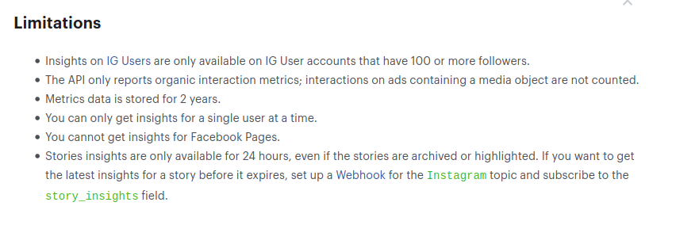

# Instagram

Esta carpeta contiene la ETL de análisis de datos de instagram.

## Información normativa

### Datos a tratar

La ETL obtiene información de la cuenta de instagram de un conjunto determinado de usuarios:

- Número de imágenes posteadas por el propietario de la cuenta.
- Impacto de dichos posts (respuestas, reacciones, likes...).
- Número de seguidores de la cuenta.

Las cuentas de las que se recopila esta información son únicamente aquellas especificadas por el propietario del proyecto. Dichas cuentas:

- Deben ser cuentas de tipo Enterprise.
- Deben estar asociadas a una página corporativa en Facebook.

El propietario de la cuenta debe autorizar la recolección de datos, iniciando sesión en esta URL habilitada a tal efecto: https://facebook.analytics.urbo2.es/

En general, sólo aceptamos cuentas asociadas a servicios públicos relacionados o directamente gestionados por los contratantes del proyecto. No se recopila información de cuentas personales, organizaciones privadas, u organismos públicos que no tengan relación con los propietarios del proyecto.

### Origen de los datos

Los datos se obtienen a través de la API de Instagram Insights, https://developers.facebook.com/docs/instagram-api/guides/insights. Esta API proporciona información anónima, estadística y agregada sobre el impacto social de la cuenta de instagram de los usuarios autorizados.

La información accesible a través de la API es limitada en alcance y duración. El siguiente cuadro recoge las limitaciones actualmente publicadas en la página anterior:



### Obtención

La obtención de datos se realiza mediante consultas periódicas a la API de intagram insights. Las consultas se realizan diariamente.

### Finalidad

La finalidad de este tratamiento de datos es el cálculo de estadísticas relacionadas con la presencia del propietario del proyecto en la red social instagram, en particular:

- Evolución de su actividad a lo largo del tiempo: mensajes publicados en las páginas relacionadas con el propietario del proyecto, número de reacciones (likes, replies, ...), seguidores, etc.

En ningún caso se procesa información de caracter personal.

### Duración

La toma de datos es diaria y se realizará durante tanto tiempo como el propietario del proyecto especifique y proporcione los medios técnicos (alojamiento para la base de datos, capacidad de proceso para las ETLs, etc).

Los datos obtenidos son totalmente anónimos y se retienen indefinidamente.

### Custodia de los datos

Los datos se almacenan en la base de datos especificada por el propietario del proyecto. La responsabilidad de la custodia de dichos datos recae en el propietario de esa base de datos.

## Configuración

La ETL de Instagram requiere que se proporcione un fichero de credenciales que se obtiene (en forma cifrada) iniciando sesión en la URL https://facebook.analytics.urbo2.es/. La ETL necesita que esas credenciales se descifren, para lo cual es necesario utilizar una clave secreta que está custodiada por los responsables de desrrollado de la ETL.

La lista de métricas a recopilar de Instagram se configura en el fichero [metrics.csv](metrics.csv). La lista completa de métricas disponibles se encuentra en las siguientes páginas de la API:

- https://developers.facebook.com/docs/instagram-api/reference/user/insights
- https://developers.facebook.com/docs/instagram-api/reference/media/insights

El fichero `metrics.csv` enumera, para las métricas a recuperar:

- El tipo de métrica (`Type`): `user`, `media`, `album` o `story`.
- El nombre de la métrica (`Metric`).
- La descripción (`Description`).
- La granularidad de la métrica. La ETL sólo reconoce dos valores posibles:

  - `day`, para métricas que representan datos diarios.
  - `lifetime`, para métricas que representan datos acumulados.

Aunque la API soporta otras granularidades (`week`, `days_28`), la ETL no hace uso de ellas.

Un ejemplo del formato del archivo `metrics.csv`:

```csv
Type,Metric,Description,Granularity
user,follower_count,Total number of new followers each day within the specified range.,day
user,profile_views,Total number of users who have viewed the IG User's profile within the specified period.,day
media,engagement,Total number of likes and IG Comments on the IG Media object.,
media,impressions,Total number of times the IG Media object has been seen.,
album,carousel_album_engagement,Total number of likes and IG Comments on the album IG Media object.,
```

Además de estos ficheros, la aplicación utiliza varias variables de entorno:

- `POSTGRES_HOST`: Nombre o IP del servidor postgres donde almacenar los datos.
- `POSTGRES_PORT`: Puerto del servidor, por defecto 5432.
- `POSTGRES_DB`: Nombre de la base de datos a usar.
- `POSTGRES_SCHEMA`: Nombre del schema dentro de la base de datos.
- `POSTGRES_USER`: Nombre de usuario para la base de datos.
- `POSTGRES_PASS`: Password del usuario.

Todas estas variables pueden también almacenarse dentro de un fichero `.env`, que será leido por la aplicación antes de comenzar la extracción de datos.
